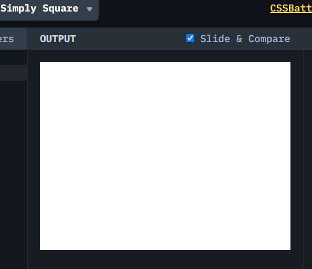

# CSSBattle #1 Simply Square

[CSSBattle](https://cssbattle.dev/) 是一个使用 HTML 和 CSS 来实现目标图案，并实时预览和对比符合程度的网站。具有很高的趣味性和游戏性。

> 我仅仅选择实现图案 ~100%的还原，不关注减少代码数。但是只要做的多，基本可以达到全球前 100 名。
> 

## 题目图案（#1 Simply Square）

使用 HTML/CSS 实现以下图案。


## 解决方案动画演示



## 解决方案步骤

直接给`div` 设置 `absolute`,并且设置 `width` and `height`。

```css
position: absolute;
top: 0;
left: 0;
width: 200px;
height: 200px;
background: #b5e0ba;
```

## Source Code

```css
    <div></div>
    <style>
        * {
            box-sizing: border-box;
        }
        body {
            background: #5d3a3a;
        }
        div {
            position: absolute;
            top: 0;
            left: 0;
            width: 200px;
            height: 200px;
            background: #b5e0ba;
        }
    </style>
```
