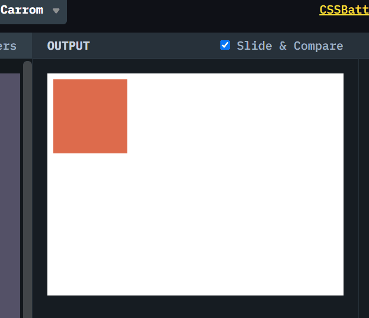

# CSSBattle #2 Carrom

[CSSBattle](https://cssbattle.dev/) 是一个使用 HTML 和 CSS 来实现目标图案，并实时预览和对比符合程度的网站。具有很高的趣味性和游戏性。

> 我仅仅选择实现图案 ~100%的还原，不关注减少代码数。但是只要做的多，基本可以达到全球前 100 名。
> 

## 题目图案（#2 Carrom）

使用 HTML/CSS 实现以下图案。


## 解决方案动画演示



## 解决方案步骤

主要实现思路是用 `position: absolute`。 当然可以用`box-shadow`来实现，会在以后的题目中经常使用。

1. 创建 4 个 `div`
2. `position: absolute` 应用到每个`div`。 结合 `top` `bottom` `left` `right`来移动`div`.

## Source Code

```CSS
    <div class="box1"></div>
    <div class="box2"></div>
    <div class="box3"></div>
    <div class="box4"></div>

    <style>
        body {
            background: #62374e;
        }

        div {
            width: 50px;
            height: 50px;
            background: #fdc57b;
        }

        .box1 {
            position: absolute;
            top: 50px;
            left: 50px;
        }

        .box2 {
            position: absolute;
            top: 50px;
            right: 50px;
        }

        .box3 {
            position: absolute;
            bottom: 50px;
            left: 50px;
        }

        .box4 {
            position: absolute;
            bottom: 50px;
            right: 50px;
        }
    </style>
```
