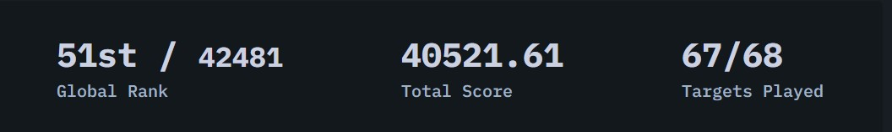
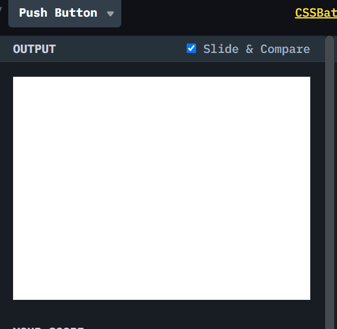

# CSSBattle #3 Push Button

[CSSBattle](https://cssbattle.dev/) 是一个使用 HTML 和 CSS 来实现目标图案，并实时预览和对比符合程度的网站。具有很高的趣味性和游戏性。

> 我仅仅选择实现图案 ~100%的还原，不关注减少代码数。但是只要做的多，基本可以达到全球前 100 名。
> 

## 题目图案

使用 HTML/CSS 实现以下图案。


## 解决方案动画演示



## 解决方案步骤

### 1. 使用 `display:flex`，把一个 `300 X 150` 的长方形居中

### 2. 创建一个 `250 X 250` 正方形。并使用 `border-radius: 50%`,把正方形变成圆，颜色为背景色

我们这里使用`position:absolute`, 把 div 移除 normal flow，然后居中它。

> `position: absolute` 如果没有指定任何 `top/right/bottom/left`, flexbox 的 alignment 还会起作用。在我们这种情况下，就会自然居中。

### 3. 创建一个 `150 X 150` 正方形，然后把他变成圆，颜色使用题目提供的颜色， `#243D83`

同样使用了`position:absolute`使元素脱离正常流，然后再 flexbox 影响下居中。

### 4. 创建一个 `150 X 150` 正方形，然后把他变成圆,颜色使用题目提供的颜色， `#EEB850`

同样使用了`position:absolute`使元素脱离正常流，然后再 flexbox 影响下居中。

## Source Code

```css
    <div class="back-rect"></div>
    <div class="light-cycle cycle"></div>
    <div class="center-cycle cycle"></div>
    <div class="inner-cycle cycle"></div>
    <style>
        body {
            background: #6592CF;
            display: flex;
            align-items: center;
            justify-content: center;
        }

        .back-rect {
            background: #243D83;
            width: 300px;
            height: 150px;
        }

        .cycle {
            position: absolute;
            border-radius: 50%;
        }

        .light-cycle {
            background: #6592CF;
            width: 250px;
            height: 250px;
        }

        .center-cycle {
            background: #243D83;
            width: 150px;
            height: 150px;
        }

        .inner-cycle {
            background: #EEB850;
            width: 50px;
            height: 50px;
        }
    </style>
```
