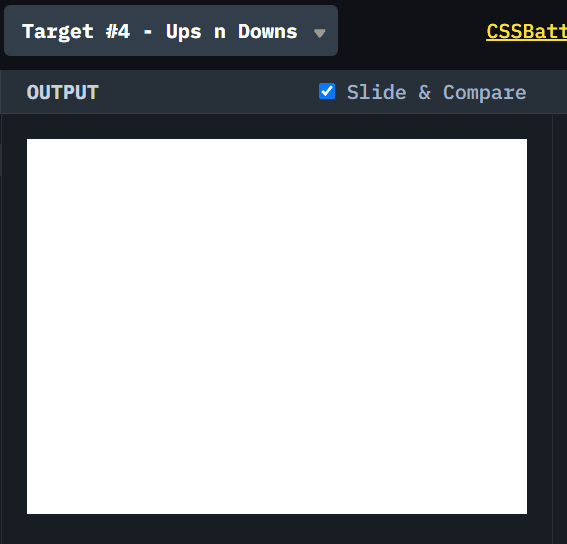

# CSSBattle #4 Ups n Downs

[CSSBattle](https://cssbattle.dev/) 是一个使用 HTML 和 CSS 实现目标图案，并进行实时预览和对比的网站。具有很强的趣味性和游戏性。

> 我仅仅选择实现 ~100%的还原，不关注减少代码数。但是只要做的多，基本可以达到全球前 100 名。
> 

> 很多减少代码数的 trick，在日常工作实践中，都是不值得提倡的。

## 题目图案

使用 HTML/CSS 实现以下图案。


主要使用的属性是:

1. **flex**
2. **transform**
3. **translateY**

## 解决方案动画演示



## 解决方案步骤

### 1. 使用 flex， 把三个正方形居中排列

### 2. 使用 border-radius 改变 边角

> [border-radius](https://developer.mozilla.org/zh-CN/docs/Web/CSS/border-radiuss) 可以对不同角指定不同角度。

### 3. 使用 `transform: translateY` 上下移动元素

> 通过使用 `translateY`，对元素进行上下移动。[MDN 参考文档](<https://developer.mozilla.org/zh-CN/docs/Web/CSS/transform-function/translateY()>)

## Source Code

```css
    <div class="box1"></div>
    <div class="box2"></div>
    <div class="box1"></div>

    <style>
        body {
            background: #62306D;
            display: flex;
            align-items: center;
            justify-content: center;
        }

        div {

            width: 100px;
            height: 100px;
            background: #F7EC7D;
        }

        .box1 {
            border-radius: 0% 0% 50% 50%;
            transform: translateY(50%)
        }

        .box2 {
            border-radius: 50% 50% 0% 0%;
            transform: translateY(-50%)
        }
    </style>
```
