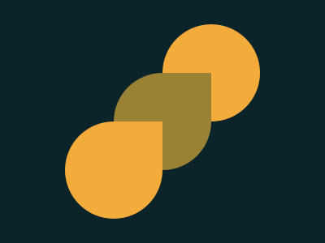

# CSSBattle #5 Acid Rain

[CSSBattle](https://cssbattle.dev/) 是一个使用 HTML 和 CSS 实现指定图案，并进行实时预览和对比的网站。具有很强的趣味性和游戏性。

> 我仅仅选择实现 ~100%的还原，不关注减少代码数。但是只要做的多，基本可以达到全球前 100 名。
> 

> 很多减少代码数的 trick，在日常工作实践中，都是不值得提倡的。

## 题目图案

使用 HTML/CSS 实现以下图案。



主要使用的属性是:

1. **flex**
2. **transform**
3. **translateY**
4. **translateX**

## 解决方案动画演示


## 解决方案步骤

### 1. body 使用 display:flex， 并且把三个正方形居中排列

> 使用 [flexbox](https://css-tricks.com/snippets/css/a-guide-to-flexbox/) 进行页面排版和居中。 易趣游戏 [flexboxfroggy](http://flexboxfroggy.com/) 学习 flebox.

### 2. 使用 `border-radius:50%` 把正方形变成圆

> [MDN border-radius](https://developer.mozilla.org/zh-CN/docs/Web/CSS/border-radiuss)

### 3. 使用 `transform: translateY translateX` 上下，左右移动三个圆

中间的圆不需要移动。

### 4. 创建 1 个 `60px X 60px`的 `div`，并且使用`position:absolute`

> 使用`position:absolute`把元素移除正常流，以便于移动元素。当在 `position:absolute` 是 flex 的 items 并且没有指定任何 `top/right/bottom/left`， flexbox 的 alignment 会应用到该元素上。

> 在我们这种情况下，`position:absolute`就会居中。

### 5. 使用`transform: translateY translateX` 上下，左右移动第 4 步创建的正方形

参考动画的演示，或者最后的代码。

### 6. 再创建 1 个 `60px X 60px`的 `div`，并且使用`position:absolute`

### 7. 使用`transform: translateY translateX` 上下，左右移动第 6 步创建的正方形

参考动画的演示，或者最后的代码。

## Source Code

```CSS
 <div class="cycle1 cycle"></div>
    <div class="cycle cycle2"></div>
    <div class="cycle3 cycle"></div>
    <div class="rect1 rect"></div>
    <div class="rect2 rect"></div>
    <style>
        body {
            background: #0B2429;
            display: flex;
            align-items: center;
            justify-content: center;
        }

        .cycle1 {
            transform: translateY(50%) translateX(50%);
            background: #F3AC3C;
        }

        .rect1 {
            background: #F3AC3C;
            transform: translateY(50%) translateX(-50%);
        }

        .rect2 {
            background: #998235;
            transform: translateY(-50%) translateX(50%);
        }

        .cycle2 {
            background: #998235;
        }

        .cycle3 {
            transform: translateY(-50%) translateX(-50%);
            background: #F3AC3C;
        }

        .cycle {
            width: 120px;
            height: 120px;
            border-radius: 50%;
        }

        .rect {
            position: absolute;
            width: 60px;
            height: 60px;
        }
    </style>
```
