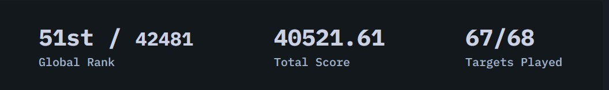

# CSSBattle #6 Missing Slice

## 题目图案

本文是 [#6 Missing Slice](https://cssbattle.dev/play/6)，实现彩色圆盘。


主要使用的属性是:

1. **flex**
2. **border**
3. **border-color**
4. **transform:rotate**

[CSSBattle](https://cssbattle.dev/) 是一个使用 HTML 和 CSS 实现指定图案，并进行实时预览和对比的网站。具有很强的趣味性和游戏性。

> 我仅仅选择实现 ~100%的还原，不关注减少代码数。但是只要做的多，基本可以达到全球前 100 名。
> 

> 很多减少代码数的 trick，在日常工作实践中，都是不值得提倡的。

## 解决方案动画演示


## 解决方案步骤

主要解决思路就是给每个边设置不同颜色。

### 1. body 使用 display:flex， 创建一个`div`并且居中

> 使用 [flexbox](https://css-tricks.com/snippets/css/a-guide-to-flexbox/) 进行页面排版和居中。 易趣游戏 [flexboxfroggy](http://flexboxfroggy.com/) 学习 flebox.

### 2. 设置 border 宽度和样式

上下左右的 border 都为 100px。换句话说就是`div`的长宽都是 200px。

### 3. 为每条边设置不同颜色

> 可以使用 [border-color](https://developer.mozilla.org/zh-CN/docs/Web/CSS/border-color),为每条边设置不同颜色。

### 4. 使用 `transform: rotate` 旋转 `div`

### 5. 使用 `border-radius` 把 `div` 变成圆

## Source Code

```CSS
<div></div>
    <style>
        body {
            background: #E3516E;
            display: flex;
        }

        div {
            /* 当flex items只有一个时候，可以使用auto居中 */
            margin: auto;
            border-radius: 100px;
            border: 100px solid;
            border-color: #FADE8B transparent #F7F3D7 #51B5A9;
            transform: rotate(45deg);
        }
    </style>
```
