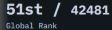
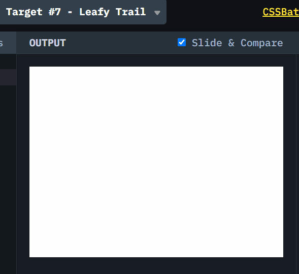

# CSSBattle #7 Leafy Trail

## 题目图案

本文是 [#7 Leafy Trail](https://cssbattle.dev/play/7)，实现多片树叶。


主要使用的属性是:

1. **flex**
2. **border-radius**
3. **box-shadow**

> [CSSBattle](https://cssbattle.dev/) 是一个使用 HTML 和 CSS 实现指定图案，并进行实时预览和对比的网站。具有很强的趣味性和游戏性。

> 我仅仅选择实现 ~100%的还原，不关注减少代码数。但是只要做的多，基本可以达到全球前 100 名。
> 很多减少代码数的 trick，在日常工作实践中，都是不值得提倡的。

## 解决方案动画演示



## 解决方案步骤

主要解决思路就是使用`border-radius`把左上和右下的角弯曲，然后再用`box-shadow`向左复制另外的 2 片叶子。

### 1. body 使用 display:flex， 创建一个`div`并且居中

这里另外使用了`translateX`向右移动了 50px。因为题目黄色叶子并不是完全居中。

> 使用 [flexbox](https://css-tricks.com/snippets/css/a-guide-to-flexbox/) 进行页面排版和居中。 易趣游戏 [flexboxfroggy](http://flexboxfroggy.com/) 学习 flebox.

### 2. 弯曲左上和右下的角

`border-radius:67% 0`. 这里只为左上和右下的角设置了弧度。

`border-radius` 可以为 4 个角，分别设置弯曲。 [MDN border-radius](https://developer.mozilla.org/zh-CN/docs/Web/CSS/border-radius)

### 3. 使用`box-shadow`向左"复制" 2 个阴影

```css
box-shadow: -50px 0 #998235, -100px 0 #1a4341;
```

对于相同图形的“复制”，用 `box-shadow` 是非常方便的。[MDN box-shadow](https://developer.mozilla.org/zh-CN/docs/Web/CSS/box-shadow)

## Source Code

```CSS
<div class="leaf"></div>
<style>
    body {
        background: #0B2429;
        display: flex;
        align-items: center;
        justify-content: center;
    }

    .leaf {
        width: 150px;
        height: 150px;
        border-radius: 67% 0;
        background: #F3AC3C;
        transform: translateX(50px);
        box-shadow:
            -50px 0 #998235,
            -100px 0 #1A4341
    }
</style>
```
