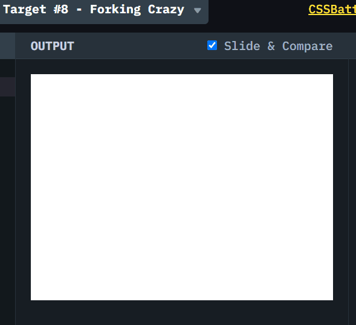

# CSSBattle #8 Forking Crazy

## 题目图案

本文是 [#8 Forking Crazy](https://cssbattle.dev/play/8)，实现一个叉子。


主要使用的属性是:

1. **flex**
2. **border-radius**
3. **box-shadow**

## 解决方案动画演示



## 解决方案步骤

主要解决思路是，用三个`div`分别表示叉头，叉身，叉柄，然后用 flexbox 排成列，再使用`box-shadow`复制叉尖，最后使用`border-radius`弯曲叉身。

### 1. body 使用 display:flex， 创建三个`div`，然后排成一列，然后居中

### 2. 使用`box-shadow`复制叉尖

这里先使用`border-radius`把长方形的四个角变圆，然后使用`box-shadow`复制叉尖。注意和背景颜色一样的 shadow 就是叉子之间的空隙。 所以这里有 6 个阴影。然后需要把叉尖向下移动 10px。

`border-radius` 可以为 4 个角，分别设置弯曲。 [MDN border-radius](https://developer.mozilla.org/zh-CN/docs/Web/CSS/border-radius) [MDN box-shadow](https://developer.mozilla.org/zh-CN/docs/Web/CSS/box-shadow)

### 3. 使用`box-shadow` 把叉身的左下和右下的边角变圆

```css
border-radius: 0 0 70px 70px;
```

### 4. 最后微调下叉柄的上下高度和位置

## Source Code

```CSS
    <div class="spike"></div>
    <div class="fork-body"></div>
    <div class="handle"></div>

    <style>
        body {
            background: #6592CF;
            display: flex;
            flex-direction: column;
            align-items: center;
            justify-content: flex-end;
            height: 100%;
            margin: 0;
        }

        .spike {
            height: 110px;
            width: 20px;
            transform: translateY(10px);
            background: #6592CF;
            border-radius: 10px 10px 10px 10px;
            box-shadow:
                -60px 0 #060F55,
                -40px 0 #6592CF,
                -20px 0 #060F55,
                20px 0 #060F55,
                40px 0 #6592CF,
                60px 0 #060F55
        }

        .fork-body {
            height: 100px;
            width: 140px;
            background: #060F55;
            border-radius: 0 0 70px 70px;
            margin-bottom: -1px;
        }

        .handle {
            height: 51px;
            width: 20px;
            background: #060F55
        }
    </style>
```
